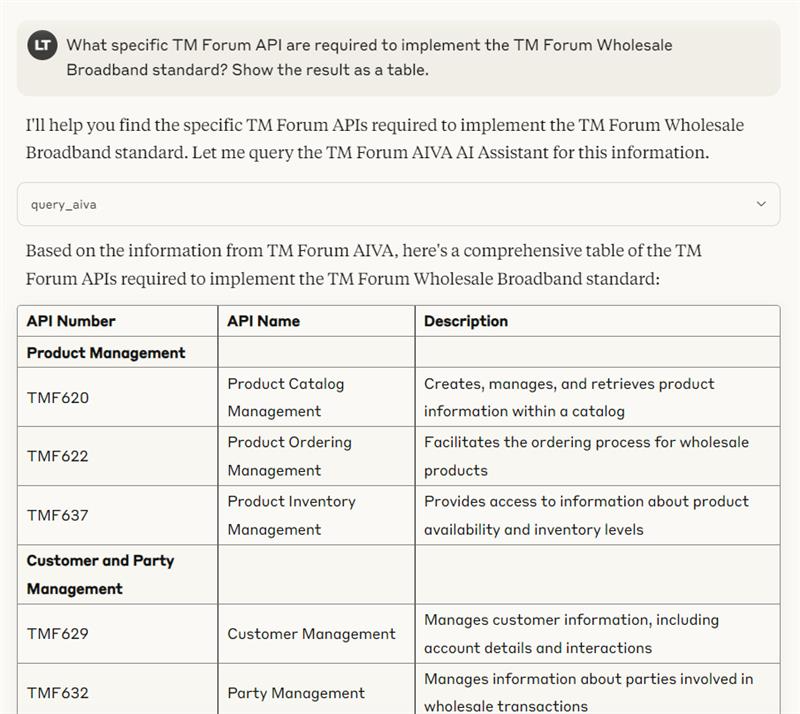
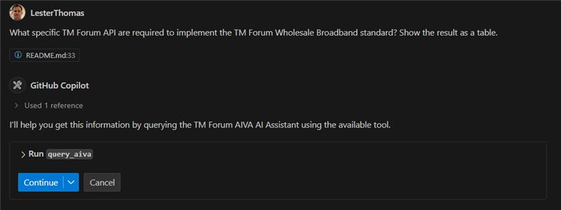
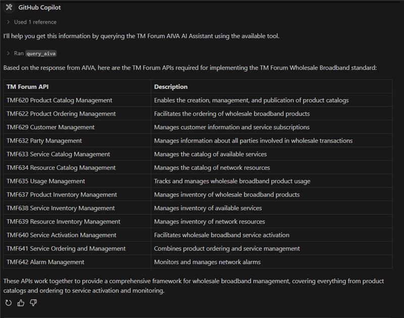

# MCP-AIVA
MCP server for the TM Forum AIVA AI Assistant

To use this locally with Claude Desktop, use the settings:


```
{
  "mcpServers": {
    "aiva": {
      "command": "uv",
      "args": [
        "--directory",
        "FULL_PATH_TO/MCP-AIVA",
        "run",
        "aiva-mcp-server.py"
      ]
    }
  }
}
```

## Example Prompts

This MCP server provides several built-in prompts that you can use:

1. Get a list of all TM Forum Open APIs:
```
List all the TM Forum Open APIs and their main purposes.
```

2. Query APIs for a specific area:
```
What specific TM Forum API are required to implement the TM Forum Wholesale Broadband standard?
```

3. Get detailed information about specific APIs:
```
What are the key features and capabilities of TMF620 Product Catalog Management API?
```

4. Get information about TM Forum standards:
```
What specific TM Forum APIs are required to implement the TM Forum Wholesale Broadband standard?
```

5. Get implementation best practices:
```
What are the best practices for implementing TMF620 Product Catalog Management API?
```

For debugging, you can execute using the MCP Inspector with:

```
npx @modelcontextprotocol/inspector uv --directory FULL-PATH-TO/MCP-AIVA/  run aiva-mcp-server.py
```


## Example Outputs

Here are example outputs in both Claude desktop and VSCode:





